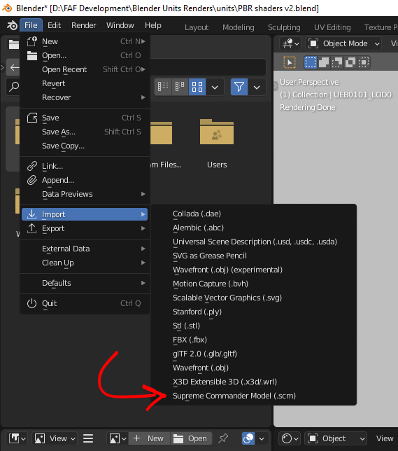
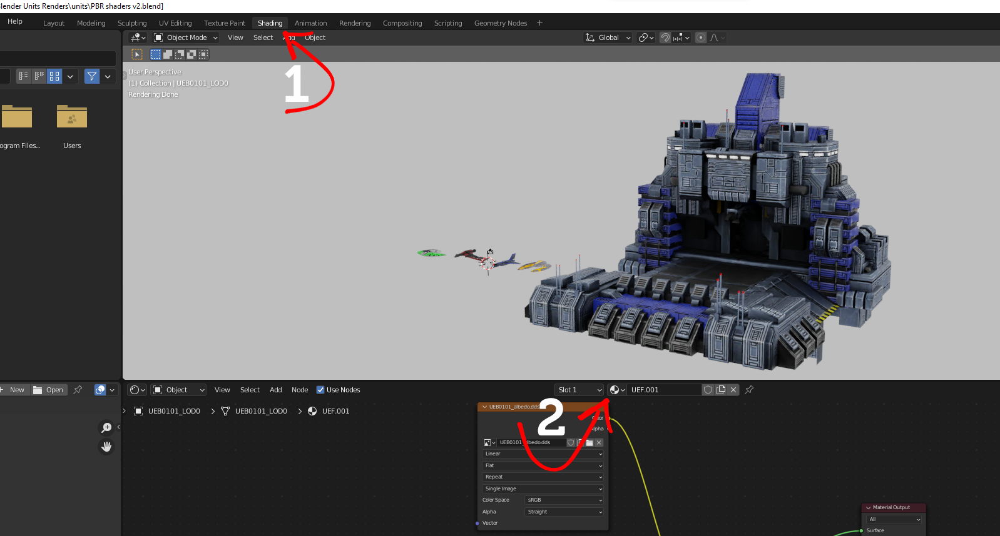
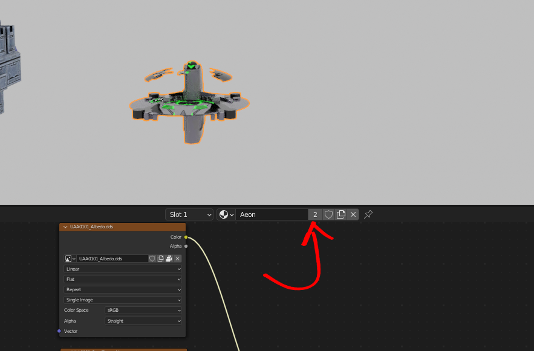
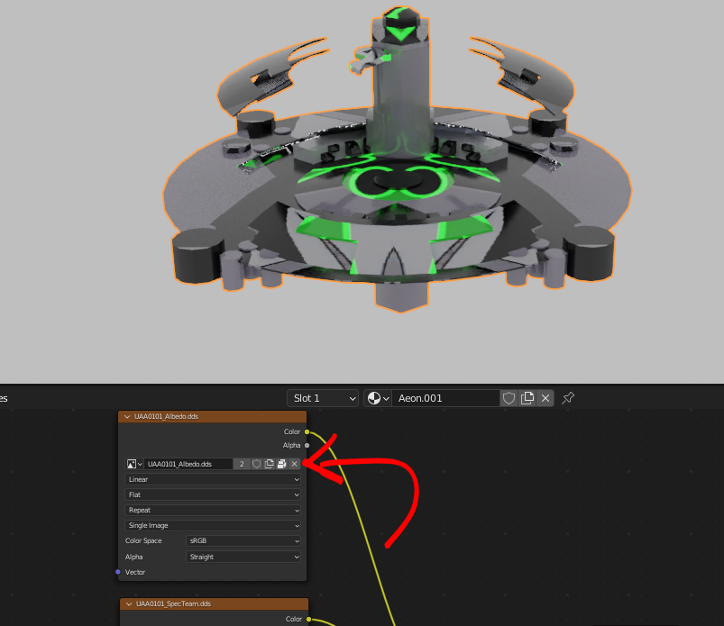

# How to Import Units & add PBR Texture

This guide can also be found on [Youtube](https://youtu.be/pq9os0NhfB4), with thanks to Rowey.

## Pre requisites

- [Blender 3.0+](https://www.blender.org/download/)
- [Supcom Importer](https://github.com/Solstice245/scstudio) This needs to be enabled in blender. Download the repository as a zip file - do not unpack it - and then install it from the blender addons interface.
- The actual unit files. Unpack `units.scd` from your original Forged Alliance installation as if it was a normal zip file.

### Importing Unit

Open [`PBR Shaders.blend`](./assets/PBR%20shaders.blend) then import the unit you want through `file > import > supreme commander model`. The unit will have a material already attached, but it is the wrong (default) material. If you want multiple models to have the right relative scale to each other, you can scale the object according to the unit's `UniformScale` in its blueprint.

### Changing the material

Change the material that the importer assigned to one of the PBR materials. It's named after the corresponding faction. In a shader editor you can change it by clicking the ball.

### Make the material only affect the current model

By default blender will just link to the existing material. Changes here would also affect the original object you got this material from. Make this material a single user by pressing the "2".

### Apply the Unit Texture

You can now change the textures to the ones appropriate for your new model. Press the "x".

Then you can open a new texture. Browse to the correct folder and select the right texture(unit_Albedo.dds).

### Setting Color Space

As a last step you need to make sure that the SpecTeam and Normal map use Non-Color colorspace.

Otherwise the unit will look kind of odd and blender likes to reset that to sRGB colorspace when changing the image.

If you want to look inside the node group you can select it and open it with "tab".
