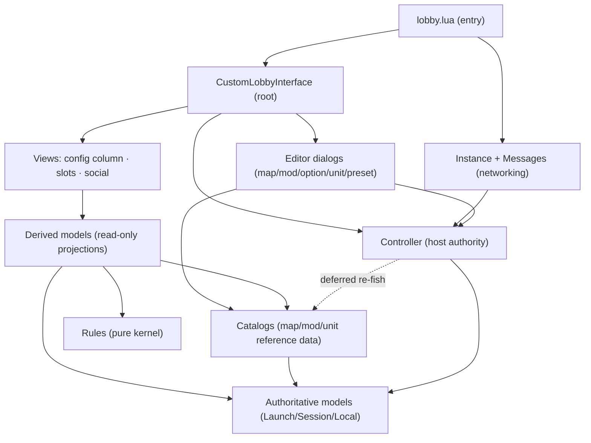
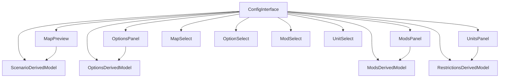
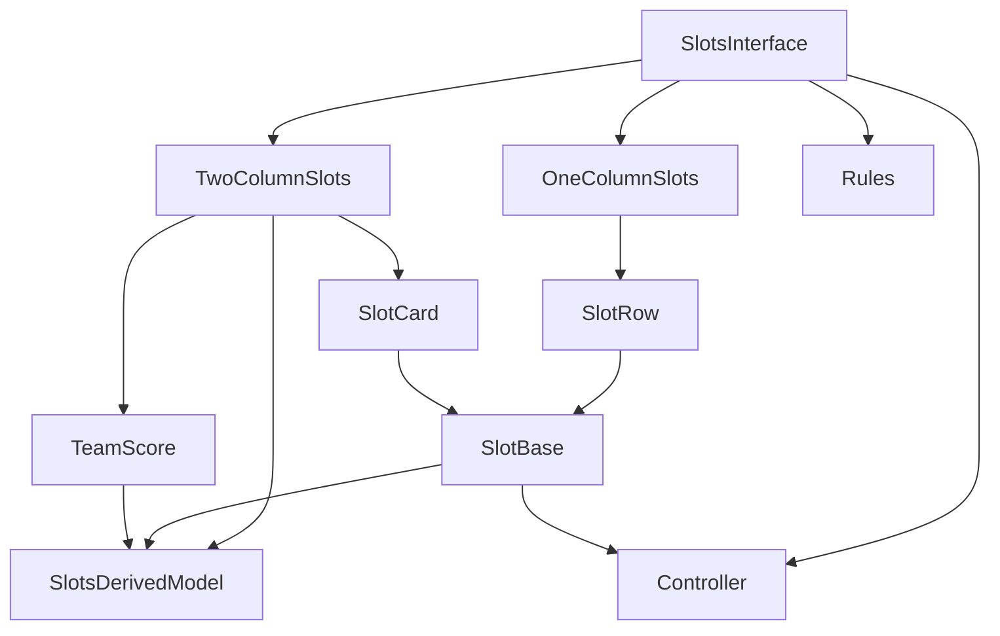
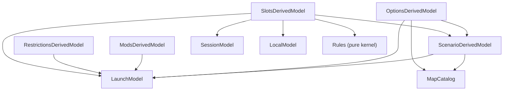
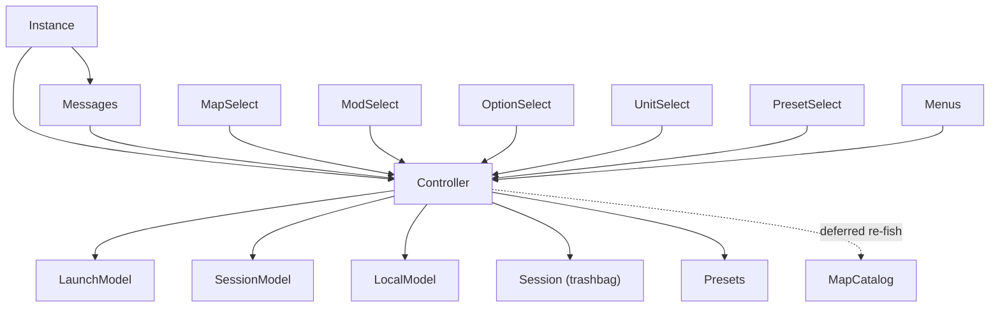

_Architecture spine (layers overview)_

```mermaid
flowchart TD
  Entry["lobby.lua (entry)"]
  Root["CustomLobbyInterface (root)"]
  Net["Instance + Messages (networking)"]
  Views["Views: config column · slots · social"]
  Dialogs["Editor dialogs (map/mod/option/unit/preset)"]
  Derived["Derived models (read-only projections)"]
  Catalogs["Catalogs (map/mod/unit reference data)"]
  Ctrl["Controller (host authority)"]
  Models["Authoritative models (Launch/Session/Local)"]
  Rules["Rules (pure kernel)"]

  Entry --> Root
  Entry --> Net
  Root --> Views
  Root --> Dialogs
  Root --> Ctrl
  Net --> Ctrl
  Views --> Derived
  Dialogs --> Catalogs
  Dialogs --> Ctrl
  Derived --> Catalogs
  Derived --> Rules
  Derived --> Models
  Catalogs --> Models
  Ctrl --> Models
  Ctrl -.->|deferred re-fish| Catalogs
```

_2. Config column_

```mermaid
flowchart TD
  CFG["ConfigInterface"]
  MPrev["MapPreview"]
  OP["OptionsPanel"]
  MP["ModsPanel"]
  UP["UnitsPanel"]
  MS["MapSelect"]
  OS["OptionSelect"]
  MdS["ModSelect"]
  US["UnitSelect"]
  DScen["ScenarioDerivedModel"]
  DOpt["OptionsDerivedModel"]
  DMods["ModsDerivedModel"]
  DRes["RestrictionsDerivedModel"]

  CFG --> MPrev
  CFG --> OP
  CFG --> MP
  CFG --> UP
  CFG --> MS
  CFG --> OS
  CFG --> MdS
  CFG --> US
  CFG --> DScen
  CFG --> DOpt
  CFG --> DMods
  CFG --> DRes
  OP --> DOpt
  MP --> DMods
  UP --> DRes
  MPrev --> DScen
```

_3. Slot subsystem_

```mermaid
flowchart TD
  SI["SlotsInterface"]
  OCS["OneColumnSlots"]
  TCS["TwoColumnSlots"]
  SRow["SlotRow"]
  SCard["SlotCard"]
  SB["SlotBase"]
  TS["TeamScore"]
  DSlots["SlotsDerivedModel"]
  Rules["Rules"]
  Ctrl["Controller"]

  SI --> OCS
  SI --> TCS
  SI --> Rules
  SI --> Ctrl
  OCS --> SRow
  TCS --> SCard
  TCS --> TS
  TCS --> DSlots
  SRow --> SB
  SCard --> SB
  SB --> DSlots
  SB --> Ctrl
  TS --> DSlots
```

_Derived layer + its sources_

```mermaid
flowchart TD
  DScen["ScenarioDerivedModel"]
  DOpt["OptionsDerivedModel"]
  DMods["ModsDerivedModel"]
  DRes["RestrictionsDerivedModel"]
  DSlots["SlotsDerivedModel"]
  LM["LaunchModel"]
  SM["SessionModel"]
  LoM["LocalModel"]
  Rules["Rules (pure kernel)"]
  MCat["MapCatalog"]

  DScen --> LM
  DScen --> MCat
  DOpt --> LM
  DOpt --> DScen
  DOpt --> MCat
  DMods --> LM
  DRes --> LM
  DSlots --> LM
  DSlots --> SM
  DSlots --> LoM
  DSlots --> DScen
  DSlots --> Rules
```

_Networking, controller & intents_

```mermaid
flowchart TD
  INST["Instance"]
  MSG["Messages"]
  Ctrl["Controller"]
  MS["MapSelect"]
  MdS["ModSelect"]
  OS["OptionSelect"]
  US["UnitSelect"]
  PS["PresetSelect"]
  Menus["Menus"]
  LM["LaunchModel"]
  SM["SessionModel"]
  LoM["LocalModel"]
  SESS["Session (trashbag)"]
  PRE["Presets"]
  MCat["MapCatalog"]

  INST --> MSG
  INST --> Ctrl
  MSG --> Ctrl
  MS --> Ctrl
  MdS --> Ctrl
  OS --> Ctrl
  US --> Ctrl
  PS --> Ctrl
  Menus --> Ctrl
  Ctrl --> LM
  Ctrl --> SM
  Ctrl --> LoM
  Ctrl --> SESS
  Ctrl --> PRE
  Ctrl -.->|deferred re-fish| MCat
```